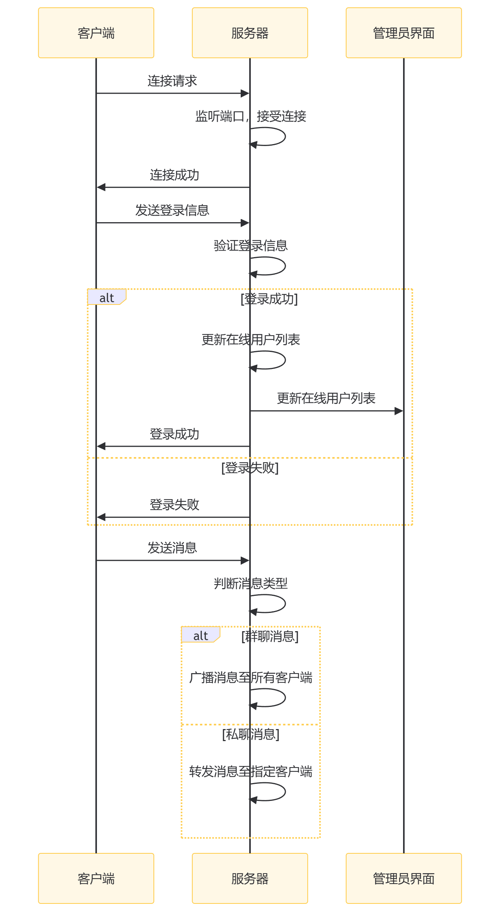
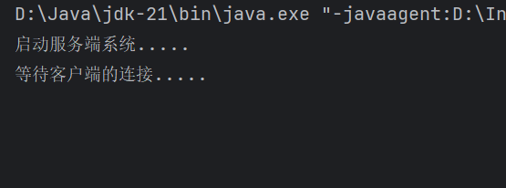
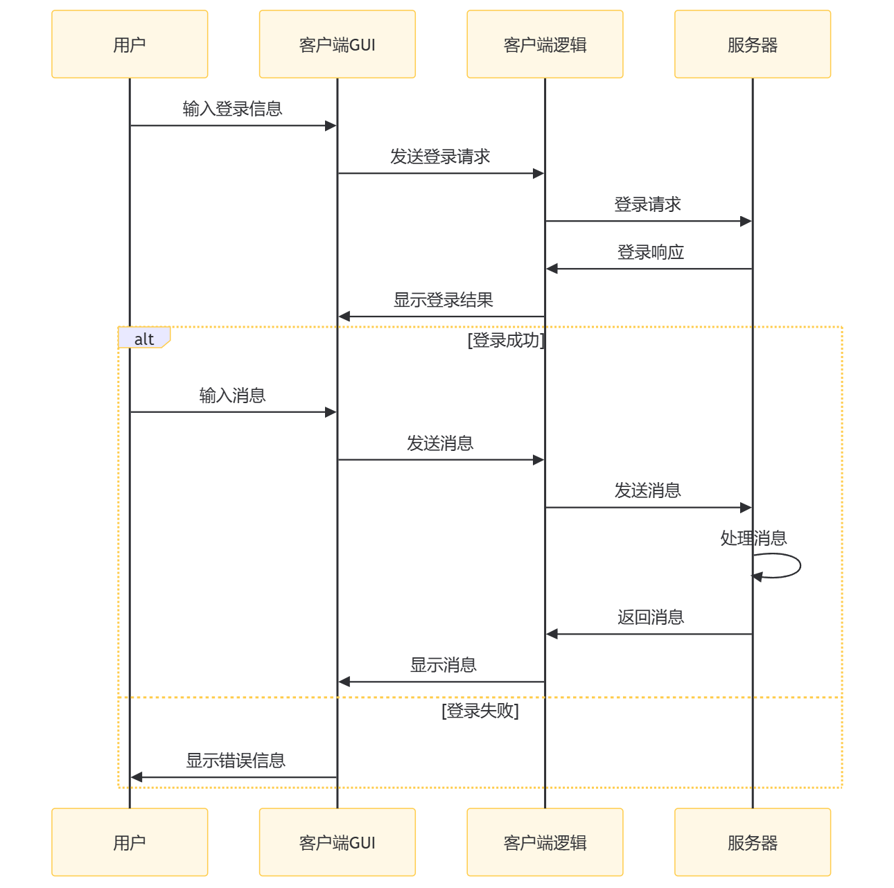
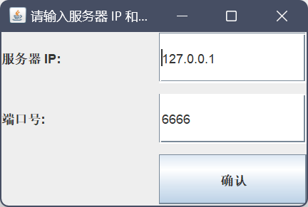
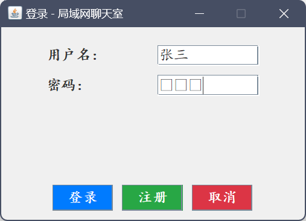
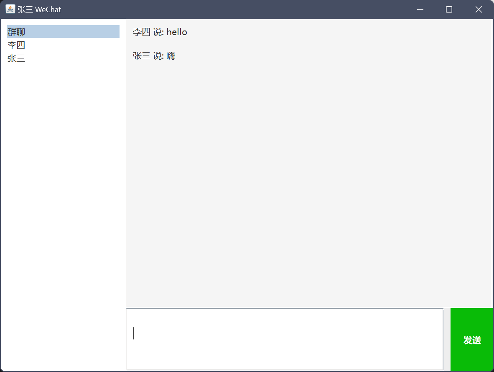
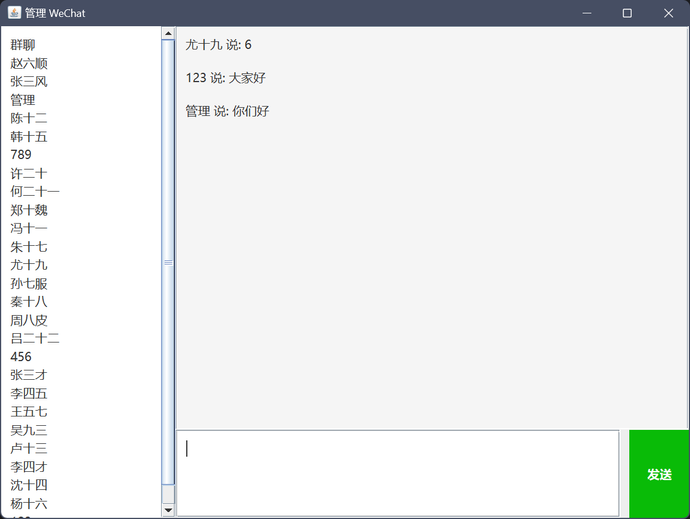

# 局域网聊天室系统（Java实现）

## 一、项目简介
基于Java开发的局域网即时通讯系统，支持群聊、私聊、在线用户管理等功能，无需互联网连接，适用于企业内网、校园局域网等场景。系统采用C/S架构，通过Socket编程实现客户端与服务器通信，利用多线程处理并发请求，确保实时性与稳定性。


## 二、技术栈
- **开发语言**：Java
- **网络通信**：Java Socket API
- **图形界面**：Swing
- **数据存储**：文本文件（用户账号、违禁词）
- **多线程**：Java多线程机制
- **协议**：自定义二进制通信协议


## 三、核心功能
1. **用户管理**  
   - 账号注册与登录（用户名唯一验证）
   - 管理员权限：查看在线用户、踢出用户

2. **通信功能**  
   - 群聊：消息广播至所有在线用户
   - 私聊：指定用户间的私密通信
   - 消息过滤：自动替换违禁词

3. **实时性支持**  
   - 在线用户列表实时更新
   - 多线程处理消息收发，确保低延迟

4. **系统特性**  
   - 异常处理：网络断开重连、客户端异常退出检测
   - 可扩展设计：支持未来功能扩展（如文件传输、视频通话）


## 四、运行环境
- **JDK版本**：JDK 8+
- **网络环境**：局域网（同一子网内或互联网）
- **端口**：服务器默认监听端口 `6666`（可在`Constant.java`中修改）


## 五、快速启动
### 1. 服务器端
```bash
# 编译服务器代码
javac Server.java ServerReaderThread.java ServerAdminFrame.java AccountManager.java Constant.java

# 启动服务器（默认端口6666）
java Server

# 管理员界面
java ServerAdminFrame
```

#### 服务端



#### 启动服务器



#### 管理员界面


### 2. 客户端

```bash
# 编译客户端代码
javac App.java ChatEntryFrame.java RegisterFrame.java ClientChatFrame.java ClientReaderThread.java Constant.java

# 启动客户端
java App

# 步骤：
# 1. 输入服务器IP和端口（如127.0.0.1:6666）
# 2. 注册/登录账号
# 3. 进入聊天界面，左侧为在线用户列表，支持双击私聊
```

#### 客户端



#### 首页



#### 账号登录



#### 聊天界面



## 六、项目结构

```
├─ src/
├─ chat-system/
│  ├─ App.java             # 客户端入口
│  ├─ ChatEntryFrame.java   # 登录界面
│  ├─ ClientChatFrame.java  # 聊天主界面
│  └─ ClientReaderThread.java # 消息接收线程
└─ chat-server/
   ├─ Server.java           # 服务器主类
   ├─ ServerReaderThread.java # 客户端连接处理线程
   └─ AccountManager.java   # 用户账号管理（文本文件存储）
├─ 局域网聊天室系统设计与实现.docx # 详细设计文档
├─ imgs                       # 文档里出现的设计图等等
├─ MyApp.jar                  # 打包好的客户端（无需环境即可运行）
├─ accounts.txt               # 账号密码存储
└─ LICENSE
```


## 七、系统架构
### C/S架构示意图
```
客户端 <---- Socket通信 ----> 服务器
         （群聊/私聊消息转发）
```

### 核心模块
- **服务器端**：  
  - 连接管理：监听端口，维护在线用户列表（`Map<Socket, String>`）
  - 消息转发：区分群聊/私聊类型，实现消息广播与定向发送
  - 管理员功能：实时监控用户，支持踢人操作

- **客户端**：  
  - 界面层：Swing实现登录、聊天、用户列表界面
  - 逻辑层：多线程处理消息收发，维护聊天窗口状态


## 八、测试结果
| 测试类型       | 结果                                                                 |
|----------------|----------------------------------------------------------------------|
| 功能测试       | 登录/注册、群聊/私聊、用户管理等功能均通过验证                       |
| 性能测试       | 支持50+客户端并发连接，响应时间<1秒                                  |
| 异常处理测试   | 网络断开后自动重连，客户端异常退出时服务器正确清理连接               |



## 九、未来扩展方向

1. **功能增强**：  
   - 支持文件传输、表情/图片消息
   - 历史消息存储与查询
   - 语音/视频通话功能

2. **架构优化**：  
   - 引入分布式部署，提升服务器扩展性
   - 消息加密传输（如AES算法）
   - 数据库替换为MySQL/Redis，提升数据管理效率


## 十、贡献指南
欢迎提交Issue或Pull Request改进项目！  
1. Fork本仓库  
2. 创建功能分支（`git checkout -b feature/new-function`）  
3. 提交代码并推送（`git push origin feature/new-function`）  
4. 发起Pull Request并描述变更内容


## 十一、联系方式
如有问题或建议，可通过以下方式联系：  
- Email：linzifei0127@outlook.com  
- Issue：https://github.com/lathezero/JavaChatSystem/issues


## 十二、许可证
**项目地址**：https://github.com/lathezero/JavaChatSystem 

**文档地址**：局域网聊天室系统设计与实现.docx（含详细设计与代码说明）